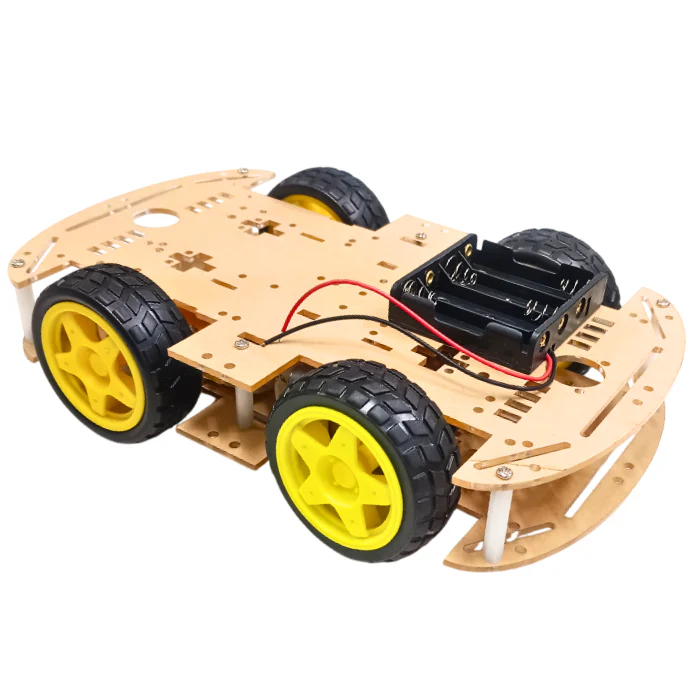
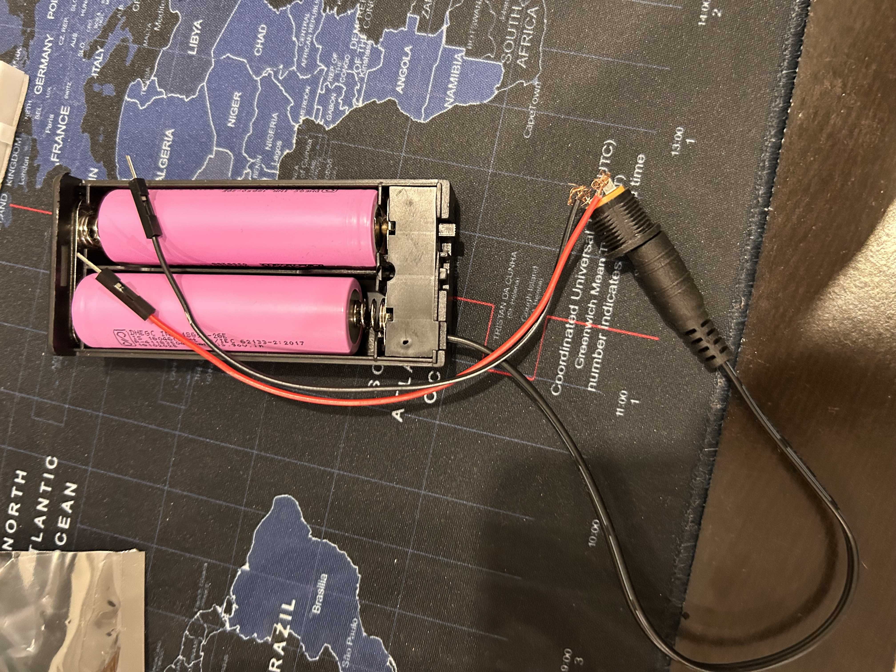
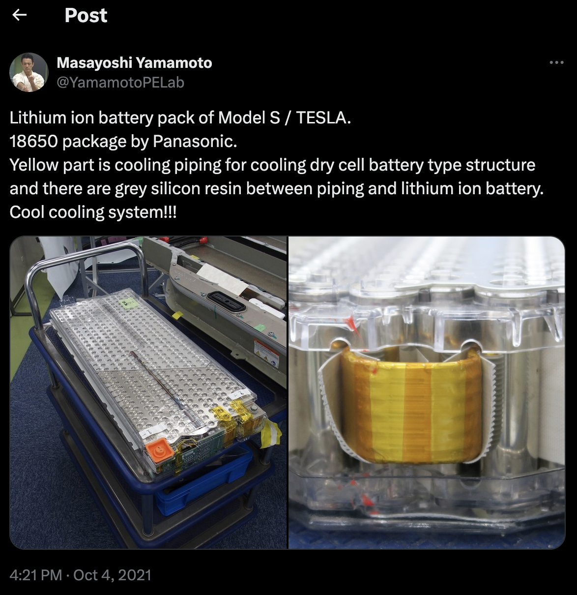
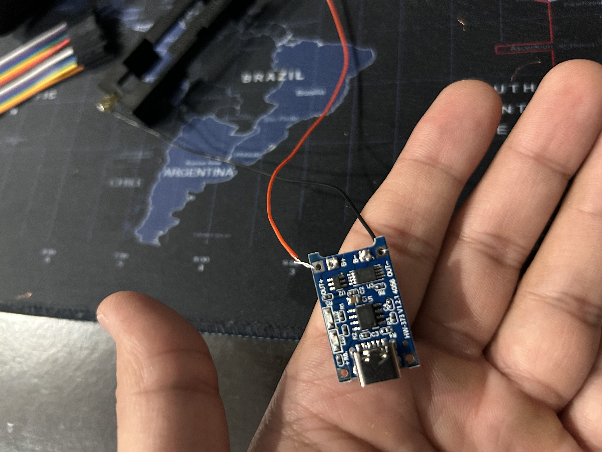
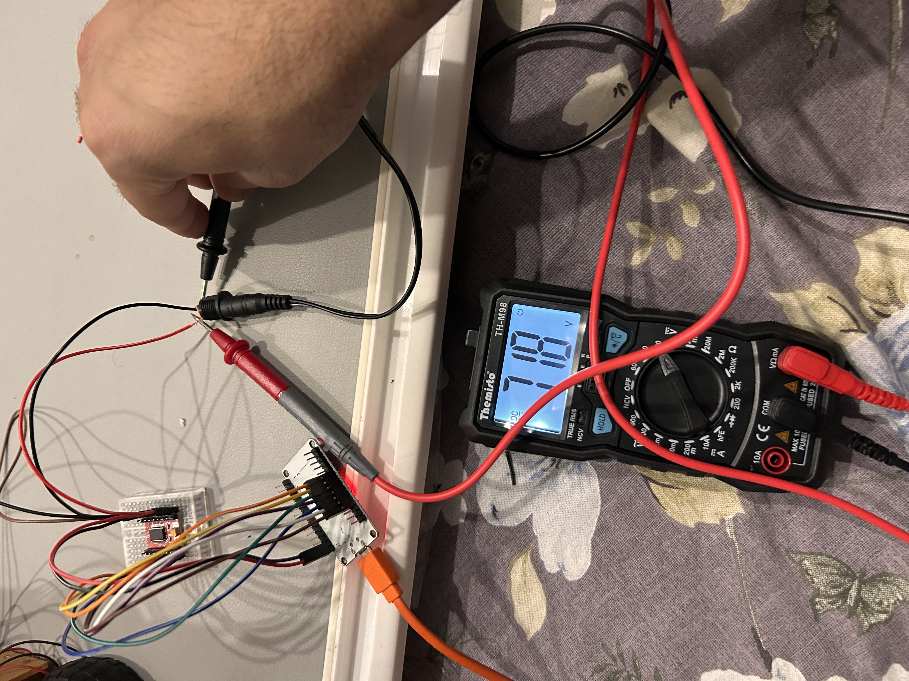
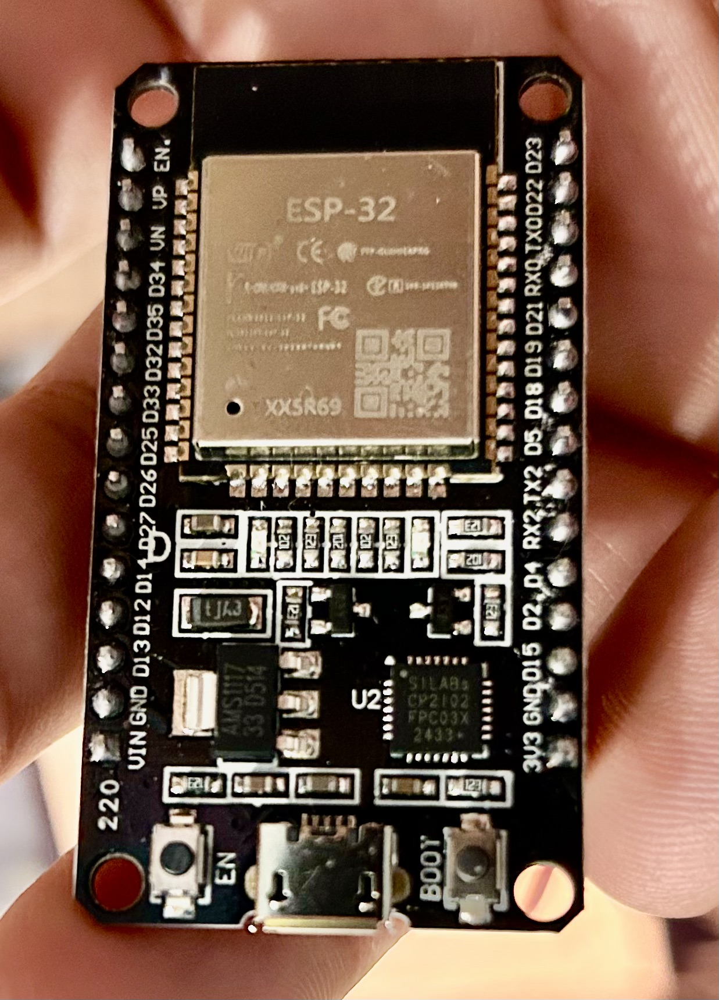
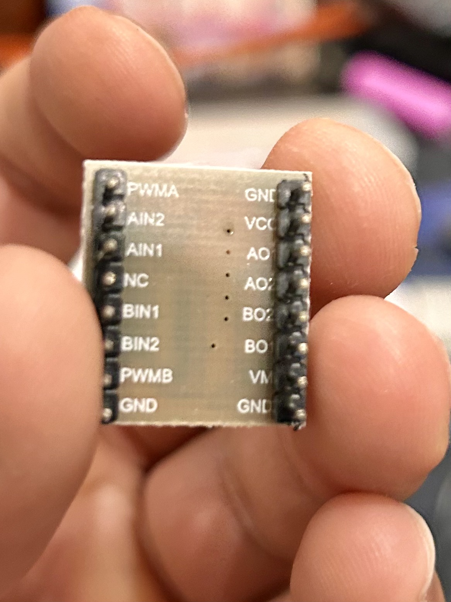
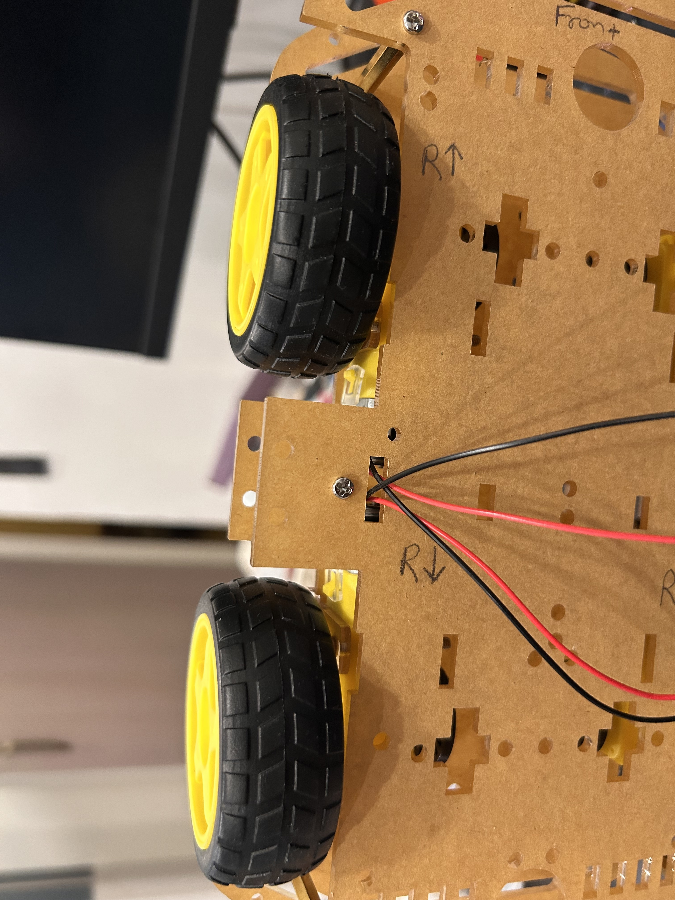

> or: How I Learned to Stop Worrying and Admire Electronics

I have been feeling hopeless ever since Claude started doing most of my work. I wanted to put the fun back in life by doing something - something which i used to feel back in college, back when i was doing dumb shit - building silly things in python or whatnot.

I thought how crazy it will be to build a robot? after all, Claude is so smart - why can't i just prompt the shit out of it and build my own silly robot?

So i started browsing internet, checking videos on youtube on how to build a robot. Turns out, it does need a lot of initial investment - atleast ₹20,000 (~$200). 
i thought i will end up wasting my money by buying all these components and then not able to stitch it together.

While researching, i find out - i don't know anything about anything. 

*i don't know how electricity works.* 

*what's the deal with so many electronics component?*

*why is every one of these thing look like a silicon chip?* 

*what's a breadboard?*  

*and why is everyone saying don't forget to check voltage with multimeter?*

Watching bunch of youtubers making DIY robot didn't help either.

So i thought what if i can make "Hello, World!" equivalent in robotics? 
 I looked around and finally *aligned* myself to make a teeny-tiny robot car - and use my phone as remote control.

## Basic mental model on motors and voltage
To make robot car or what most tutorial videos call it on youtube, "Arduino 4WD Robot Car", you need to buy bunch of small things and stitch it together.

To keep things simple - let's just assume there is nothing robotic about it. 
just imagine the toy car you had in your childhood - there was a battery and a motor and maybe few wheels. 

when you put one wire to the +ive terminal and another wire to -ive terminal - it makes motor move. if you change the terminals - the motor moves in opposite direction. 

everything we are going to do will be based on this principle - Voltage difference moves the motor

## A little bit about Ohm's law (V = IR)

What makes motors move is actually the Voltage difference b/w its terminals. 

`Voltage`, `Current` and `Resistance` - the holy trinity - it always confused me back in school days. 

After watching bunch of videos, talking to LLMs - i kinda picture these things as following:

> Voltage is just difference b/w potential energy between two points

Think of water flowing down from mountain top.

* At the top of mountain - when water flows down - it will move fast toward the ground/sea level. why? because there is height difference and gravity.

* Now if the mountain has rough edges, bunch of rocks - the water will move slower.

* Height difference b/w mountain top and ground -> Potential Entergy -> `Voltage`
* The water flow rate -> how many eletrons moved per second -> `Current`
* The rocks, rough edges -> `Resistance`

Same principle applies to batteries. 
When battery dies - the potential differnce b/w its terminals goes to zero. 
the resistance is fixed. 
the number of electrons remains the same in wire before and after. 
but the current goes to zero because there is no force to move the current. 

In a way, you can say that Voltage is like a graviy for electrons - the difference make the electrons move



> A small note on convention: the glowing beads above show the direction of **current** (`+` → motor → `−`), which is what every schematic, datasheet, and wiring diagram uses. Electrons are negatively charged, so they physically drift in the *opposite* direction (`−` → motor → `+`). Same phenomenon, two different arrows — we'll stick with current throughout this post.

Alright! let's go back to assembling the car

## Components you need to buy

1. [4WD chassis kit](https://robu.in/product/longer-version-4-wd-double-layer-smart-car-chassis/ "4WD double-layer smart car chassis with 4 motors and wheels, Robu.in") - 4 wheels, 4 motors, a chassis and wires.

Note: it won't come in assembled form. you need to assemble it yourself, do soldering to stick the wires on the motor terminals etc. 

2. [18650 Li-ion battery](https://robu.in/product/dmegc-inr18650-26e-3-7v-2600mah-li-ion-battery/ "DMEGC INR18650-26E 3.7V 2600mAh Li-ion cell, Robu.in") - 2 Batteries specifically `18650 Li-ion` battery + Battery Holder

These are most common rechargeable batteries - used in bunch of electronic items. 

> The amazing thing about 18650 Li-ion battery is that initial Tesla cars used to have this exact same battery - hundreds of 18650 cells enclosed in a box.

3. [TP4056](https://robu.in/product/tp4056-1a-li-ion-lithium-battery-charging-module-with-current-protection-type-c "Adjustable 1A Li-ion lithium Battery Charging Module with Overcurrent Protection") Charger for battery - you will soon need it

The charger looks weird. but it cost only ₹14(~15 Cents). you need to use Type C to charge it. One battery at a time only, and it does take time.

4. [Multimeter](amazon.in/Themisto-TH-M98-Digital-Multimeter-Counts/dp/B097RS212G) - The most important purchase you are ever going to make here is multimeter.

5. [ESP32](https://robu.in/product/esp-wroom-32-esp32-wifi-bt-ble-mcu-module "Make sure you are buying ESP32 which has wifi and bluetooth module") - the brain of your car

6. [TB6612FNG](https://www.amazon.in/dp/B0CJ5PDCSN?ref=ppx_yo2ov_dt_b_fed_asin_title) - this is a MOSFET based motor module - it's the most important component here. this thing makes   voltage dance.

7. [M-to-M jumper wires](https://robu.in/product/male-to-male-jumper-wires-40-pin-30cm/ "40-pin 30cm male-to-male jumper wire strip, Robu.in") and [M-to-F jumper wires](https://robu.in/product/male-to-female-jumper-wires-40-pin-30cm/ "40-pin 30cm male-to-female jumper wire strip, Robu.in")

8. [Soldering iron kit](https://blinkit.com/prn/fadman-soldering-iron-tool-kit-10-pcs/prid/608236 "Fadman 10-piece soldering iron tool kit, Blinkit")

9. [Breadboard](https://robu.in/product/mb102-830-points-solderless-prototype-breadboard-power-supply-module-140-jumper-wires-arduino-diy-starter-kit/) - Buy the bigger one so that you can do bunch of experiments at home with capacitors, resistance etc

10. [Buck Converter](https://robu.in/product/lm2596-buck-step-power-converter-module-dc-4-040-1-3-37v-led-voltmeter/) - To protect ESP32 from battery's high voltage

## Now the hard part - Assembly 
First assemble the wheels, motors and chassis to create our base toy car. Make sure to test the wheel by connecting directly to battery and write down the direction it moves. 

i wrote down explicitly and marked on the chassis

a. On Top left - when Red -> +ive and Black -> -ive terminal on battery. the wheel moves forward

b. On Rear left - When Red -> +ive and Black -> -ive terminak on battery. the wheel moves backward.
 

This is critical step. Remember the wheel direction and connectivity with battery terminals.

### ESP32
This is the the brain of your car. you will write logic(code) to trigger on,off on the pins. these pins are called `GPIO` (General Purpose Input Output) pins. 
a pin can be either in high(3.3V) or low(0V) state. 
the `ESP32` is not going to directly power the motor - it is only going to give instructions.

Now to control the speed of motor/wheel - you need to control the `Voltage` or `Current`. 
If you pass the higher `Current` - the wheel will move faster. 
if you pass lower `Current` or `Voltage` - the motor will move slower.

From `V = I x R` - Since input `V` is supplied by those 2x `18650 Li-ion` Batteries.  
You can control the input `Current` by tweaking the `Resistance`. If you put a higher reistance before the motor - you can effectively reduce the `Current` it can get. 
but higher `Resistance` means high temperature - not the best way to handle effective `Voltage` or `Current` 

### Pulse width modulation
Smart people have figured out long ago that to control the `Voltage` - you don't need to add `Resistance` and waste energy in form of heat. You need to modulate the electric signals. 


>The term duty cycle describes the proportion of 'on' time to the regular interval or 'period' of time; a low duty cycle corresponds to low power, because the power is off for most of the time. 

### TB6612FNG
This sits between `ESP32` and Motors. It listens to the `ESP32` signals and uses it to control the `Voltage` with `Pulse Width Modulation` (PWM). 
This H-Bridge is MOSFET based and used to control the speed and direction of the wheel.
you can read more about [TBFNG internals](https://dronebotworkshop.com/tb6612fng-h-bridge/) here

### Programming
You need to flash/burn the code in `ESP32` so that it can listen to your inputs and control the `TB6612FNG`.
The code part is pretty easy - you can take the references from web or use Claude to build those things. 
the most important thing i learned is - it's all `MMIO` ([Memory Mapped IO](https://en.wikipedia.org/wiki/Memory-mapped_I/O_and_port-mapped_I/O)).

You are writing program in C by interacting with predefined memory addresses on those pins in `ESP32` which eventually controlling the hardware.
This [brilliant video by Artful Bytes](https://youtu.be/sp3mMwo3PO0?si=UiTYdgAU9qY9DywD) explained this mind blowing concept - i am still not sure i understand it but it's mindblowing nonetheless 

My inital goal was to just move one side of wheels - with fixed set of instructions. 
Forward - Stop - Backward.  


[You can checkout the code](https://github.com/prdpx7/eletronics-101/blob/master/firmware/motor_test_right/motor_test_right.ino) here

### Wiring everything
You need to follow the instructions to wire the component - follow the pins - pins will follow the current. you will write programs to trigger 0/1 on the pins. 



You can follow the [detailed wiring instructions](https://prdpx7.github.io/eletronics-101/wiring-guide.html) here

## Up and running
It took a lot of time to make this work because the H-Bridge i bought initially was not working properly.  
I got tired of checking voltage b/w pins and arguing with Claude but somehow i persisted because i just wanted to make it work. 

Finally after everything - when the wheels started moving - that was my Eureka!! moment.



## Conclusion
Most important thing i learned while doing all of this is
> Just like everything is file in linux. i think everything is voltage in electronics

Now i am glad Claude and other LLM exist in this world. 

As [Scott Galloway](https://www.profgmedia.com/p/moonshot) say *Life is so rich*

